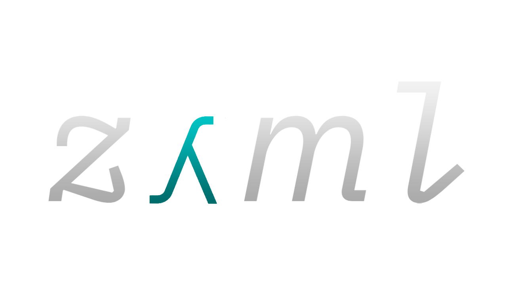

A type inferred, statically-typed functional programming language inspired by OCaml

## Documentation

- TODO

## Running

There are two options for running zaml:

-> Running the REPL:

```bash
dune exec zaml
```

-> Interpret from a `.zml` file:

```bash
dune exec zaml example.zml
```

## Testing

```bash
dune runtest
```

## TODO list

-> Next-up

- [ ] Better Syntax Errors
  - [x] Line Positions
  - [ ] Character Positions
    - [x] REPL
    - [ ] Intepreter (they don't reset for some reason)

-> Core Language

- [x] Evaluation
- [x] Let variable expressions
- [x] Let function expressions
- [ ] Let tuple with destructuring
- [x] Lambda expressions
- [x] If expressions
- [x] Partial Applications
- [ ] Match expressions
- [ ] Algebraic effects
- [x] Ranges (1..31 -> [1; 2; ... 30; 31])
- [ ] Standard library
  - [ ] Universal `print` function
  - [x] ! (or `not`, function for booleans)
  - [ ] Figure out what else to include
- [ ] Binary operators
  - [x] Universal ops
    - [x] ==
    - [x] !=
    - [x] > , =>
    - [x] <, =<
  - [ ] Int ops
    - [x] +
    - [x] -
    - [x] *
    - [x] /
    - [x] %
  - [ ] String ops
    - [x] ++ (string concat)
    - [ ] I don't know yet
  - [x] 'a list
    - [x] @ (append)
    - [x] :: (cons)
- [ ] Garbage Collection

-> Types

- [x] Typechecking (Generalized Hindley-Milner (inspired by Didier Remy))
- [ ] Refinement types
- [ ] Union types
- [ ] Algebraic data types
- [ ] Data types
  - [x] Unit
  - [x] Int
  - [x] Bool
  - [x] Char
  - [ ] Float
  - [x] String
  - [x] Var
  - [x] Arrow (x -> y)
  - [ ] Product (tuples)
  - [x] 'a list
  - [ ] 'a array
